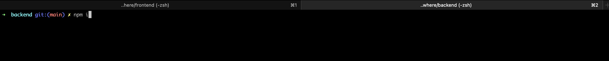
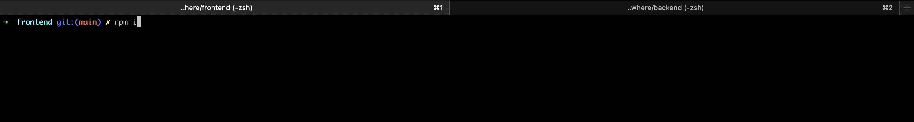

## Project Setup

---

### Getting started

My build environment is macOS. <br/>

1. Open up the repository in VSCode. Follow the instructions below to complete the setup. <br/>

## Instructions

1. Go back to the the terminal cd into the backend.

 <br/>

2. Once you have cd into the backend run the following commands in this exact order:

```
npm install
npm run db:init
npm run db:seed
npm start
```

7. Now go back to the terminal and create a new tab and cd into the frontend.

 <br/>

8. Once you have cd into the frontend run the following commands in this exact order:

```
npm install
npm start

```
